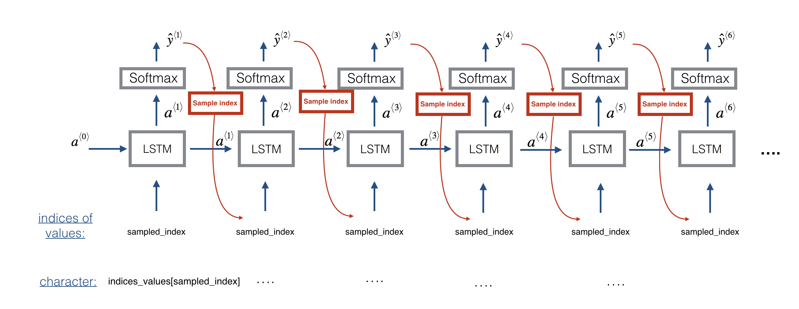

# Jazz Improvisation with LSTM

In this project, we will implement a model that uses an LSTM to generate music.

**Goal:**
- Apply an LSTM to music generation.
- Generate your own jazz music with deep learning.

### 1 - Overview of our model
Here is the architecture of the model we will use.The architecture is as follows:

### 2 - Generating music
You now have a trained model which has learned the patterns of the jazz soloist. Lets now use this model to synthesize new music.

#### 2.1 - Predicting and sampling

At each step of sampling, you will take as input the activation `a` and cell state `c` from the previous state of the LSTM, forward propagate by one step, and get a new output activation as well as cell state. The new activation `a` can then be used to generate the output, using `densor` as before. 

To start off the model, we will initialize `x0` as well as the LSTM activation and and cell value `a0` and `c0` to be zeros. 

#### 2.2 - Generate music 
Finally, we are ready to generate music. Our RNN generates a sequence of values. The code generates music by first calling the `predict_and_sample()` function. These values are then post-processed into musical chords (meaning that multiple values or notes can be played at the same time). 

Most computational music algorithms use some post-processing because it is difficult to generate music that sounds good without such post-processing. The post-processing does things such as clean up the generated audio by making sure the same sound is not repeated too many times, that two successive notes are not too far from each other in pitch, and so on. One could argue that a lot of these post-processing steps are hacks; also, a lot the music generation literature has also focused on hand-crafting post-processors, and a lot of the output quality depends on the quality of the post-processing and not just the quality of the RNN. But this post-processing does make a huge difference, so lets use it in our implementation as well. 

## Things to remember 
Here's what we should remember:
- A sequence model can be used to generate musical values, which are then post-processed into midi music. 
- Fairly similar models can be used to generate dinosaur names or to generate music, with the major difference being the input fed to the model.  
- In Keras, sequence generation involves defining layers with shared weights, which are then repeated for the different time steps **1, ..., Tx**. 

# References

The ideas presented in this notebook came primarily from three computational music papers cited below. The implementation here also took significant inspiration and used many components from Ji-Sung Kim's github repository.

- Ji-Sung Kim, 2016, [deepjazz](https://github.com/jisungk/deepjazz)
- Jon Gillick, Kevin Tang and Robert Keller, 2009. [Learning Jazz Grammars](http://ai.stanford.edu/~kdtang/papers/smc09-jazzgrammar.pdf)
- Robert Keller and David Morrison, 2007, [A Grammatical Approach to Automatic Improvisation](http://smc07.uoa.gr/SMC07%20Proceedings/SMC07%20Paper%2055.pdf)
- François Pachet, 1999, [Surprising Harmonies](http://citeseerx.ist.psu.edu/viewdoc/download?doi=10.1.1.5.7473&rep=rep1&type=pdf)
